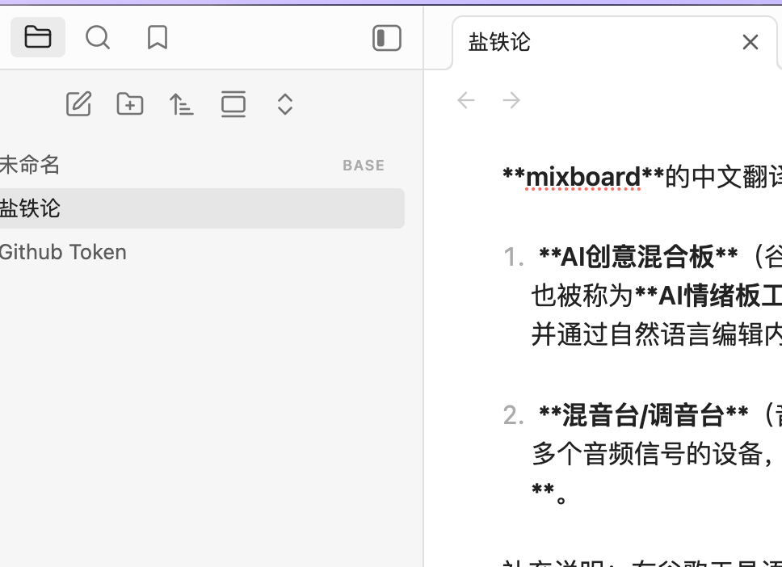

### 核心释义
举及众者无顿功：**发动并联结众人共事的人，不会有白费的功夫**，指做事凝聚集体力量，所有付出的努力皆有成效，功不唐捐。

### 字词拆解
- 举：发动、推行、倡举
- 及：联结、惠及、聚合
- 众：众人、大众、群体
- 顿功：白费的功夫、徒劳之功，“顿”为**空耗、无实效**之意。

### 内涵解读
这句话核心强调**集体力量的重要性**，与“众人拾柴火焰高”“独行快，众行远”的理念相通，说明做事并非单打独斗，若能凝聚众人的智慧与力量，朝着同一目标推进，每一份努力都会转化为实际成效，不会出现徒劳无功的情况。

**mixboard**的中文翻译：

1.  **AI创意混合板**（谷歌工具）：Google Labs于2025年9月推出的**实验性AI创意画板工具**，也被称为**AI情绪板工具**或**混合画板**，提供无限画布，支持文字提示生成图像、上传素材并通过自然语言编辑内容，用于快速探索和展示创意灵感。

2.  **混音台/调音台**（音频领域）：**mixing board**的==简写形式==，指用于混合、调整和控制多个音频信号的设备，常见于音乐制作、直播和广播领域，也称为**混音面板**或**调音面板**。

补充说明：在谷歌工具语境中，"mixboard"强调**混合**（mix）多种素材（文字、图片、AI生成内容）的能力，创造统一的视觉效果。

补充说明：在谷歌工具语境中，"mixboard"强调**混合**（mix）多种素材（文字、图片、AI生成内容）的能力，创造统一的视觉效果。

补充说明：在谷歌工具语境中，"mixboard"强调**混合**（mix）多种素材（文字、图片、AI生成内容）的能力，创造统一的视觉效果。

尝试不成功

成功

